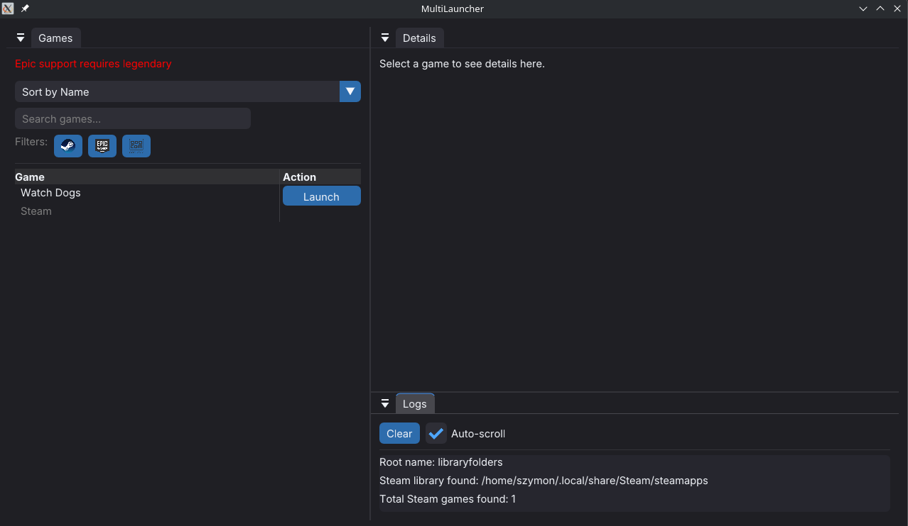
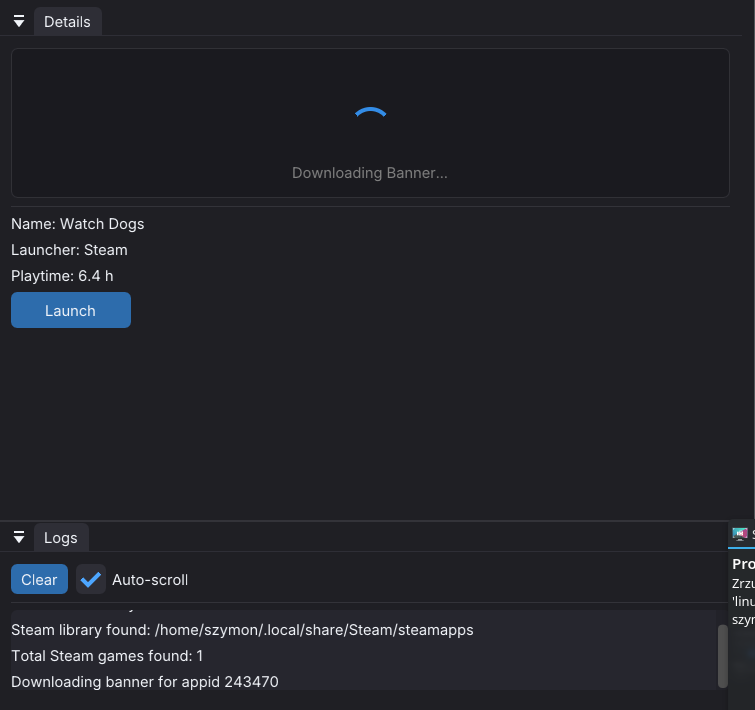
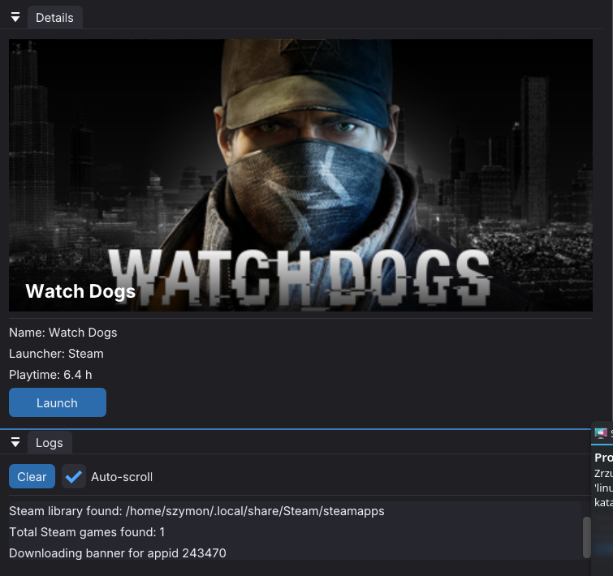

# MultiLauncher
Cross-platform game launcher written in C++ using Dear ImGui.
Supports Epic Games downloads via community tools, and Steam games (only installed ones).

## Screenshots - Linux

### Main view



### Downloading banner


### Game details


### Features

- Epic Games Store downloads (via community tool)
- Steam games support (only installed ones)
- GOG support (WIP)
- ImGui based GUI
- Windows Support
- Linux Support (WIP)

## Building

### Prerequisites

**Linux (Debian/Ubuntu):**
```bash
$ sudo apt-get install build-essential cmake pkg-config libx11-dev libxrandr-dev libxinerama-dev libxcursor-dev libxi-dev libgl1-mesa-dev libcurl4-openssl-dev
```
**Linux (Arch): **
```bash
$ sudo pacman -S build-essential cmake pkg-config libx11-dev libxrandr-dev libxinerama-dev libxcursor-dev libxi-dev libgl1-mesa-dev curl
```
**Windows:**
- Visual Studio with C++ Desktop Development (includes CMake)

### Build with CMake

```bash
mkdir build
cd build
cmake ..
cmake --build .
```


# Dependencies

- [Dear ImGui](https://github.com/ocornut/imgui/tree/docking)
- OpenGL (Linux)
- DirectX 11 (Windows)
- [Legendary (Epic games CLI)](https://github.com/derrod/legendary)

## Project status
This project is currenlty **WIP**.
Some features may be be incomplete or unstable

### Disclaimer

This project is not affiliated with Epic Games.
Epic Games is trademark of Epic Games Inc.
